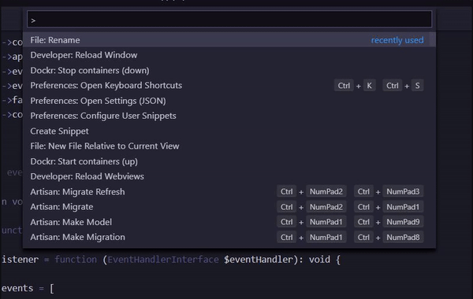

# Dockr for VS Code

This extension integrates with [dockr-cli](https://github.com/dugajean/dockr-cli)  and allows you to easily toggle your containers on and off.

###### Usage Demo

## Pre-requisites

You must download [Dockr CLI](https://github.com/dugajean/dockr-cli) and put it in your path or install it via composer.

## Installation

1. `Press CTRL + SHIFT + X` to open your extensions
2. Search for *Dockr*
3. Install the extension

## Configuration

Open your Settings (`CTRL + ,`) and search for *dockr*. You will find a field where you can insert the path to the Dockr executable. 

Defaults to `dockr`, but it could be something like `php path/to/dockr.phar` or even `vendor/bin/dockr` if you have installed it via Composer for your project.

## License
Dockr VS Code extension is released under [the MIT License](LICENSE).